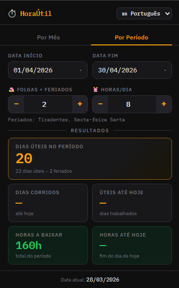

# ⏱ HoraÚtil — Extensão de Calculadora de Dias Úteis

Extensão para Chrome/Edge/Firefox que calcula dias úteis, horas a baixar e feriados nacionais brasileiros para qualquer mês ou período.

## Funcionalidades

- **Por Mês**: Selecione apenas o mês/ano e tudo é calculado automaticamente
- **Por Período**: Defina datas de início e fim customizadas
- **Feriados nacionais** do Brasil (fixos + móveis via Páscoa) detectados automaticamente
- **Folgas**: adicione dias de folga pessoal descontados dos dias úteis
- **Horas/Dia** configurável (padrão: 8h)
- Salva configuração entre sessões

## Resultados calculados

| Campo                     | Descrição                                                            |
| ------------------------- | -------------------------------------------------------------------- |
| **Dias Úteis no Período** | Total de dias úteis (sem fins de semana, sem feriados, menos folgas) |
| **Dias Corridos**         | Dias de calendário decorridos do início até hoje                     |
| **Úteis até Hoje**        | Dias úteis trabalhados do início até hoje                            |
| **Horas a Baixar**        | `Dias úteis × Horas/dia` — total do período                          |
| **Horas até Hoje**        | `Dias úteis até hoje × Horas/dia`                                    |

## Feriados incluídos

**Fixos:** Confraternização Universal, Tiradentes, Dia do Trabalho, Independência, N.Sra. Aparecida, Finados, Proclamação da República, Natal.

**Móveis (calculados por ano):** Carnaval (2ª e 3ª), Sexta-feira Santa, Páscoa, Corpus Christi.

## Como instalar

1. Baixe e descompacte a pasta `hora-util-ext`
2. Abra `chrome://extensions` no Chrome (ou `edge://extensions` no Edge)
3. Ative o **Modo do desenvolvedor** (canto superior direito)
4. Clique em **Carregar sem compactação**
5. Selecione a pasta `hora-util-ext`

### Firefox

1. Abra `about:debugging#/runtime/this-firefox`
2. Clique em **Carregar extensão temporária...**
3. Selecione o arquivo `manifest.json` dentro da pasta
